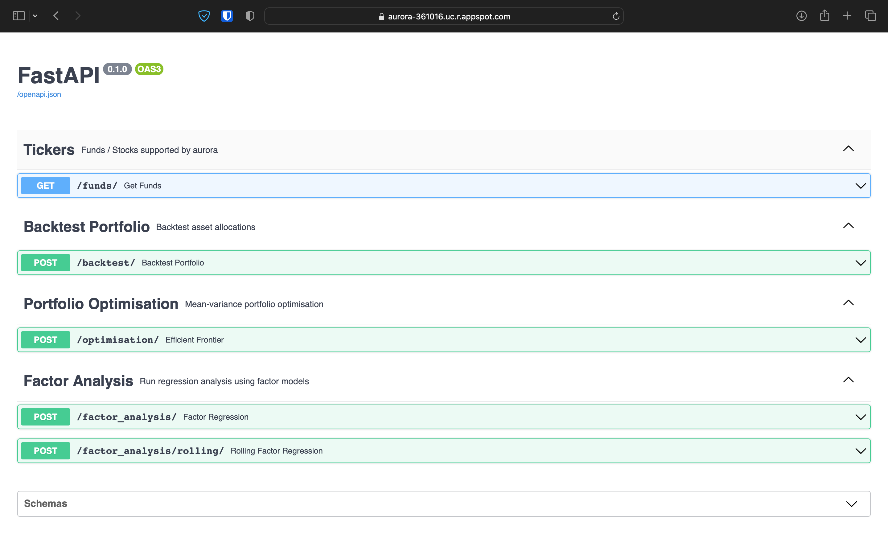

# PortfolioBuilderAPI
Portfolio Builder API built using FastAPI and hosted on GCP

## Financial Analysis:
- Portfolio Backtesting
    - Backtest different asset allocations and compare historical performance
- Factor Analysis
    - Run regression analysis using French-Fama / other factor models
- Portfolio Optimisation
    - Generate efficient frontiers to explore risk return trade offs

## Technical Features:
### Pure python
- Uses [FastAPI](https://fastapi.tiangolo.com/)
### Data
- Google Cloud Storage
### Automatic Tests
- Test coverage reports using [codecov](https://about.codecov.io/) & [pytest](https://docs.pytest.org/en/7.1.x/)
### Continous Integration /Continious Deployment
- [Pre-commit](https://pre-commit.com/) for identifying issues before PR
- CI/CD using [Github Actions](https://github.com/yeungadrian/Aurora/actions)
